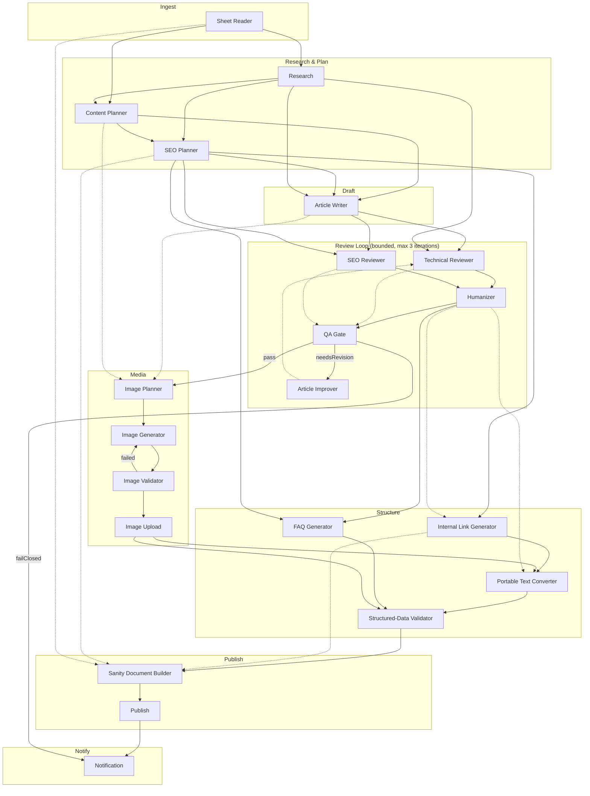

# 17 — Module Dependency Diagram

## Purpose

`03-module-flow.md` already states the orchestrator execution order in prose and a plain-text box diagram. This document makes the *dependency* structure (as opposed to the *execution* order, which is one valid topological sort of the dependency graph) explicit and visual, because "what can run in parallel" and "what must be sequential" are two different questions that a linear execution-order listing conflates. A commercial platform's ability to add a 22nd module, or to reorder existing ones for a latency win, depends on knowing the real dependency graph, not just the order this document happened to describe modules in.

## Legend

- **Solid arrow** — a hard data dependency (target needs a field the source produced).
- **Dashed arrow** — an ordering dependency without a data dependency (target must run after source for a business-logic reason, but doesn't consume source's output directly).
- **Same rank / no arrow between two nodes** — independent; safe to parallelize.

## Full pipeline dependency graph

## Parallelization table (restated from `06-cost-optimization.md`/`11-performance.md`, consolidated here as the single reference for "what can run concurrently")

| Group | Modules | Why parallel is safe |
|---|---|---|
| Reviewers | Technical Reviewer, SEO Reviewer | Both depend only on `state.draft` + their own planning input; neither reads the other's output. |
| Images (generation) | Image Generator × N images | Each image's prompt is independent; no image's generation depends on another's result. |
| Images (validation) | Image Validator × N images | Same reasoning — each validates one already-generated image independently. |
| Pipeline runs | Any two runs for different Sheet rows | Runs share no mutable state — each owns its own `PipelineState` (see `04-json-contracts.md`'s revised per-run isolation). Bounded only by provider concurrency limits (`11-performance.md`). |

## Sequential-only (real data dependencies — never parallelize)

| Dependency | Why |
|---|---|
| Sheet Reader → Research | Research needs the actual topic brief. |
| Research/Content Planner/SEO Planner → Article Writer | The writer needs the finished outline, angle, and keyword targets — this is the pipeline's highest-leverage sequential chain, and no amount of infrastructure changes that; it's a genuine content dependency. |
| Both reviewers → Humanizer | Humanizer must know what issues exist so it doesn't accidentally undo a fix the review loop is about to request. |
| Humanizer → QA Gate | QA re-checks the *current* (humanized) draft, not the pre-humanize one. |
| Internal Link Generator → Portable Text Converter | `internalLink` markDefs need real resolved post IDs before the Portable Text structure can be built — this is the one place this architecture already documents an execution order that differs from module *numbering* (`03-module-flow.md`'s "Dependency correction" note), restated here as a graph edge so it's visible without reading prose. |
| Image Upload → Portable Text Converter | Embedded `image` blocks need real Sanity `asset._ref` values, which only exist after upload. |
| Everything content-producing → Sanity Document Builder | The builder assembles the final document from every prior module's output; it is a genuine convergence point, and cannot start before its last input is ready. |
| Sanity Document Builder → Publish → Notification | Strict write-then-report chain; Publish's idempotency check (`07-error-handling.md`) further requires this to never be re-ordered or spliced with a retry of an unrelated step. |

## Independent (no dependency either direction, but not literally parallelized because there's no shared resource benefit)

| Modules | Why not worth parallelizing despite independence |
|---|---|
| Image Planner and Internal Link Generator's non-LLM lookup path | Both are cheap/fast and run in different pipeline phases (Media vs. Structure) — parallelizing across phases would complicate the orchestrator's phase-based state persistence (`core/stateStore.ts` checkpoints after each phase) for a latency win measured in low single-digit seconds. Not worth the added orchestration complexity at this scale. |
| FAQ Generator and Structured-Data Validator's field-presence checks | FAQ Generator's output is itself one of the fields the validator checks — technically FAQ Generator must complete first (a real, if thin, dependency), so these are not actually independent; listed here only to correct an initial-glance impression that they might be. |

## Modules that consume `PipelineState` without producing a new section

Per the revised `PipelineState` design (`04-json-contracts.md` companion update), a small number of modules read broadly across the state but don't own a section of their own:

| Module | Reads | Writes |
|---|---|---|
| Structured-Data Readiness Validator | `seo`, `draft`, `images`, `publishing`-adjacent fields, `metadata` | `structuredDataCheck` (its own small section — it does write one, just a narrow validation-result one, not a content section) |
| Sanity Document Builder | nearly the entire state | `sanity.document` |
| Cost Reporter (`15-cost-tracking-system.md`) | `metrics.costEvents` only | nothing — it's a pure read-side reporting view, never part of the write path at all, which is why it's listed separately from every content-producing module here |

These are the natural **convergence points** in the graph — any future module added upstream of Sanity Document Builder does not require touching the builder's logic (it already reads broadly and defensively per `04-json-contracts.md`'s revised ownership rules), but any module intended to feed a *new* field into the final document must be added to the builder's explicit read list, which is the one place in this architecture where "reads broadly" is correct and intentional rather than a coupling smell — see `19-architecture-audit-and-readiness.md`'s discussion of this as a reviewed, accepted design tradeoff rather than an oversight.
